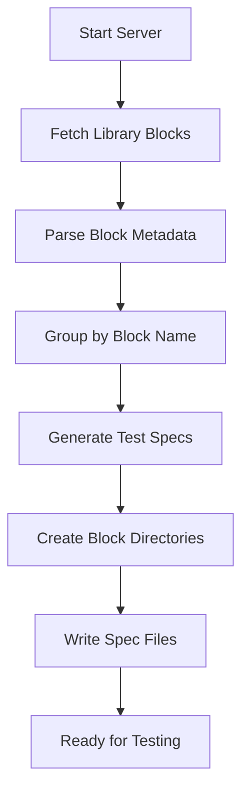
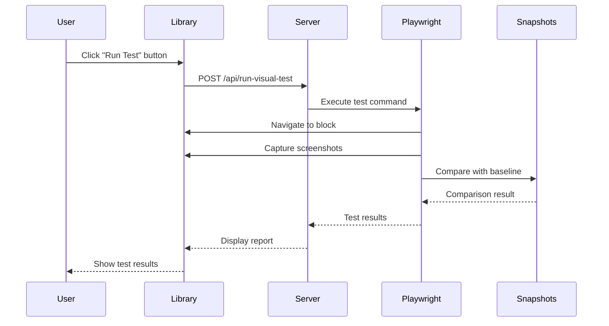

# AEM Visual Testing Framework - Documentation

## Overview

This document outlines the new features and improvements implemented in the `figma` branch compared to the `visual-test` branch. The visual testing framework has been significantly enhanced with better organization, Figma integration, and improved maintainability.

---

## Table of Contents

1. [Folder Structure Reorganization](#folder-structure-reorganization)
2. [Figma Utility Integration](#figma-utility-integration)
3. [Visual Testing Architecture](#visual-testing-architecture)
4. [Key Improvements](#key-improvements)
5. [Usage Guide](#usage-guide)
6. [Configuration](#configuration)

---

## Folder Structure Reorganization

### Previous Structure (`visual-test` branch)

```
tools/visual-tests/
├── visual.spec.js                           # Single monolithic test file
├── visual.spec.js-snapshots/                # All snapshots in one folder
│   ├── cards-0-desktop.png
│   ├── cards-0-large.png
│   ├── cards-0-mobile.png
│   ├── cards-0-tablet.png
│   ├── hero-0-desktop.png
│   ├── tabs-0-desktop.png
│   └── ... (all snapshots mixed together)
├── generate-visual-tests.js
├── visual-test.js
└── server.js
```

**Issues with Previous Structure:**
- ❌ All tests in a single file (500+ lines)
- ❌ All snapshots in one directory (difficult to manage)
- ❌ Poor scalability as more blocks are added
- ❌ Difficult to run tests for individual blocks
- ❌ No block-specific configuration support

### New Structure (`figma` branch)

```
tools/visual-tests/
├── blocks/                                   # Block-specific organization
│   ├── cards/
│   │   ├── cards.spec.js                    # Dedicated test file
│   │   ├── config.js                        # Block-specific configuration
│   │   └── cards.spec.js-snapshots/         # Block-specific snapshots
│   │       ├── cards-0-Desktop.png
│   │       ├── cards-0-Large.png
│   │       ├── cards-0-Mobile.png
│   │       └── cards-0-Tablet.png
│   ├── hero/
│   │   ├── hero.spec.js
│   │   └── hero.spec.js-snapshots/
│   │       ├── hero-0-Desktop.png
│   │       ├── hero-0-Large.png
│   │       ├── hero-0-Mobile.png
│   │       └── hero-0-Tablet.png
│   └── tabs/
│       ├── tabs.spec.js
│       └── tabs.spec.js-snapshots/
│           ├── tabs-0-Desktop.png
│           ├── tabs-0-Large.png
│           ├── tabs-0-Mobile.png
│           ├── tabs-0-Tablet.png
│           ├── tabs-1-Desktop.png
│           └── ... (variation snapshots)
├── figma-util.js                            # NEW: Figma integration utility
├── generate-visual-tests.js                 # Enhanced test generator
├── visual-test.js                           # Visual test initialization
├── server.js                                # Test server with API
├── start-visual-test-server.js
└── package.json
```

**Benefits of New Structure:**
- ✅ **Modular Organization**: Each block has its own directory
- ✅ **Isolated Snapshots**: Snapshots are grouped by block
- ✅ **Block-Specific Configuration**: Each block can have custom settings
- ✅ **Selective Testing**: Run tests for individual blocks
- ✅ **Better Maintainability**: Easy to locate and update tests
- ✅ **Scalability**: Adding new blocks is straightforward
- ✅ **Version Control**: Better git diffs and conflict resolution

---

## Figma Utility Integration

### New Feature: `figma-util.js`

The `figma` branch introduces a powerful Figma integration utility that allows automatic downloading of design mockups from Figma to use as visual test baselines.

#### Key Features

1. **Figma URL Parsing**
   - Automatically extracts file ID and node ID from Figma URLs
   - Supports both `/file/` and `/design/` URL formats
   - Converts node-id format (`1-2` → `1:2`)

2. **Figma API Integration**
   - Authenticates using `FIGMA_ACCESS_TOKEN` environment variable
   - Fetches image URLs from Figma API
   - Supports multiple image formats (PNG, JPG, SVG, PDF)
   - Configurable scale factors (1x, 2x, 4x)

3. **Automated Image Download**
   - Downloads images directly from Figma
   - Saves to appropriate block snapshot directories
   - Handles errors gracefully with detailed logging

4. **Batch Processing**
   - Scans all block folders for `config.js` files
   - Processes multiple Figma configurations per block
   - Parallel downloads for efficiency

#### Configuration Format

Each block can have a `config.js` file with Figma configuration:

```javascript
// tools/visual-tests/blocks/cards/config.js
export const FIGMA_CONFIG = [
  {
    name: 'cards-0-Desktop',
    figmaUrl: 'https://www.figma.com/design/[fileId]/[fileName]?node-id=1-2',
    format: 'png',
    scale: 1,
  },
  {
    name: 'cards-0-Mobile',
    figmaUrl: 'https://www.figma.com/design/[fileId]/[fileName]?node-id=1-3',
    format: 'png',
    scale: 2,
  },
];
```

**Legacy Format Support:**
```javascript
export const FIGMA_CONFIG = [
  {
    name: 'cards-0-Desktop',
    figmaFile: 'fileId123',
    figmaNode: '1:2',
    format: 'png',
    scale: 1,
  },
];
```

#### Usage

**Setup:**
1. Create a `.env` file in the project root:
   ```env
   FIGMA_ACCESS_TOKEN=your_figma_token_here
   ```

2. Generate a Figma access token:
   - Go to Figma → Settings → Account → Personal Access Tokens
   - Create a new token with read access

**Download Figma Images:**
```bash
npm run test:visual:figma
```

This command:
- Scans all block folders in `tools/visual-tests/blocks/`
- Reads `config.js` files with `FIGMA_CONFIG`
- Downloads images from Figma API
- Saves them to block-specific snapshot directories

**Output Example:**
```
Scanning 3 block folders for Figma configurations...

📦 Processing block: cards
   Found 4 Figma configuration(s)
   ✅ Downloaded: cards-0-Desktop.png
   ✅ Downloaded: cards-0-Mobile.png
   ✅ Downloaded: cards-0-Tablet.png
   ✅ Downloaded: cards-0-Large.png

📦 Processing block: hero
   Found 4 Figma configuration(s)
   ✅ Downloaded: hero-0-Desktop.png
   ...

✨ Summary:
   Blocks processed: 3/3
   Total images downloaded: 12
```

---

## Visual Testing Architecture

### Test Generation Process

The framework uses an automated test generation system:



#### Test Generator (`generate-visual-tests.js`)

**Process:**
1. Launches headless browser
2. Navigates to sidekick library
3. Extracts block information from DOM (including variations)
4. Groups blocks by name
5. Generates individual test files for each block
6. Creates block-specific directories

**Generated Test Structure:**
```javascript
test.describe('Cards Visual Tests', () => {
  test.beforeEach(async ({ page }) => {
    await page.setViewportSize({ width: 1280, height: 2000 });
  });

  test('cards visual test at Mobile viewport', async ({ page }) => {
    // Test implementation for Mobile
  });

  test('cards visual test at Tablet viewport', async ({ page }) => {
    // Test implementation for Tablet
  });

  test('cards visual test at Desktop viewport', async ({ page }) => {
    // Test implementation for Desktop
  });

  test('cards visual test at Large viewport', async ({ page }) => {
    // Test implementation for Large
  });
});
```

### Visual Test Flow



### Test Server (`server.js`)

**Features:**
- Express server running on port 3001 (configurable)
- CORS enabled for cross-origin requests
- Health check endpoint (`/api/health`)
- Visual test execution endpoint (`/api/run-visual-test`)
- Serves Playwright HTML reports
- Automatic port detection and reuse

**API Endpoints:**

1. **Health Check**
   ```
   GET /api/health
   Response: { "status": "ok" }
   ```

2. **Run Visual Test**
   ```
   POST /api/run-visual-test
   Body: { "command": "test:visual:block", "component": "cards" }
   Response: { "success": true, "output": "...", "stderr": "..." }
   ```

3. **Playwright Report**
   ```
   GET /playwright-report/index.html
   ```

### Visual Test UI Integration (`visual-test.js`)

**Features:**
- Detects `vtest` query parameter in URL
- Adds "Run Test" button to sidekick library
- Shows server status indicator
- Displays test results in modal
- Embeds Playwright HTML report

**UI Components:**
- 🟢 **Green indicator**: Server running
- 🔴 **Red indicator**: Server not running
- **Run Test button**: Triggers test execution
- **Modal dialog**: Shows test results

---

## Key Improvements

### 1. **Modular Test Organization**

**Before:**
```javascript
// Single file with all tests (500+ lines)
test('cards visual test at Mobile viewport', ...);
test('cards visual test at Tablet viewport', ...);
test('hero visual test at Mobile viewport', ...);
test('hero visual test at Tablet viewport', ...);
// ... 16+ tests in one file
```

**After:**
```javascript
// cards/cards.spec.js (focused, ~217 lines)
test.describe('Cards Visual Tests', () => {
  // Only cards tests
});

// hero/hero.spec.js (focused)
test.describe('Hero Visual Tests', () => {
  // Only hero tests
});
```

### 2. **Selective Test Execution**

**New Commands:**
```bash
# Test all blocks
npm run test:visual:blocks

# Test specific block
npm run test:visual:block -- tools/visual-tests/blocks/cards

# Update specific block snapshots
npm run test:visual:block:update -- tools/visual-tests/blocks/cards
```

### 3. **Figma Design Integration**

**Workflow:**
1. Designer creates mockup in Figma
2. Developer adds Figma URL to block's `config.js`
3. Run `npm run test:visual:figma` to download baseline images
4. Run tests to compare implementation against design

**Benefits:**
- Single source of truth (Figma designs)
- Automated baseline generation
- Easy design updates
- Designer-developer collaboration

### 4. **Better Snapshot Management**

**Before:**
```
visual.spec.js-snapshots/
├── cards-0-desktop.png
├── cards-0-mobile.png
├── hero-0-desktop.png
├── tabs-0-desktop.png
└── ... (30+ files mixed together)
```

**After:**
```
blocks/
├── cards/cards.spec.js-snapshots/
│   ├── cards-0-Desktop.png
│   ├── cards-0-Mobile.png
│   └── ...
├── hero/hero.spec.js-snapshots/
│   ├── hero-0-Desktop.png
│   └── ...
└── tabs/tabs.spec.js-snapshots/
    └── ...
```

### 5. **Naming Convention Standardization**

**Before:** `cards-0-mobile.png` (lowercase)  
**After:** `cards-0-Mobile.png` (PascalCase matching viewport labels)

This ensures consistency across:
- Viewport configuration
- Snapshot filenames
- Test descriptions

### 6. **Enhanced Configuration System**

**Global Configuration** (`test-config/config.js`):
```javascript
export const VIEWPORTS = [
  { width: '320px', height: '568px', label: 'Mobile', icon: 'device-phone' },
  { width: '768px', height: '1024px', label: 'Tablet', icon: 'device-tablet' },
  { width: '1024px', height: '768px', label: 'Desktop', icon: 'device-desktop' },
  { width: '1440px', height: '900px', label: 'Large', icon: 'device-desktop', default: true },
];

export const OVERLAY = {
  imageRoot: '/tools/visual-tests/blocks',
};

export const SIDEKICK_CONFIG = {
  JSONPath: '/tools/sidekick/library/library.json',
  templatesPath: '/tools/sidekick/library/templates/',
};
```

**Block-Specific Configuration** (`blocks/[block]/config.js`):
```javascript
export const FIGMA_CONFIG = [
  {
    name: 'cards-0-Desktop',
    figmaUrl: 'https://www.figma.com/design/...',
    format: 'png',
    scale: 1,
  },
];
```

---

## Usage Guide

### Initial Setup

1. **Install Dependencies**
   ```bash
   npm install
   ```

2. **Configure Figma Token (Optional)**
   ```bash
   echo "FIGMA_ACCESS_TOKEN=your_token_here" > .env
   ```

3. **Start Development Server**
   ```bash
   npm start
   ```
   This starts both the AEM server and visual test server concurrently.

### Workflow

#### Option 1: Manual Test Generation

1. **Generate Test Files**
   ```bash
   npm run test:visual:generate
   ```

2. **Run Tests**
   ```bash
   npm run test:visual
   ```

3. **View Results**
   ```bash
   npm run test:visual:report
   ```

#### Option 2: Figma-Based Workflow

1. **Create Block Configuration**
   ```javascript
   // tools/visual-tests/blocks/my-block/config.js
   export const FIGMA_CONFIG = [
     {
       name: 'my-block-0-Desktop',
       figmaUrl: 'https://www.figma.com/design/...',
       format: 'png',
       scale: 1,
     },
   ];
   ```

2. **Download Figma Baselines**
   ```bash
   npm run test:visual:figma
   ```

3. **Generate and Run Tests**
   ```bash
   npm run test:visual:generate
   npm run test:visual
   ```

#### Option 3: Interactive UI Testing

1. **Start Servers**
   ```bash
   npm start
   ```

2. **Open Browser**
   ```
   http://localhost:3000/tools/sidekick/library.html?plugin=blocks
   ```

3. **Navigate to Block**
   - Select a block from the sidebar
   - Click "Run Test" button
   - View results in modal

### Updating Snapshots

**Update All Snapshots:**
```bash
npm run test:visual:update
```

**Update Specific Block:**
```bash
npm run test:visual:block:update -- tools/visual-tests/blocks/cards
```

**Update from Figma:**
```bash
npm run test:visual:figma
```

---

## Configuration

### Environment Variables

```env
# Figma Integration
FIGMA_ACCESS_TOKEN=your_figma_personal_access_token

# Server Configuration
PORT=3001
CI=false
```

### Playwright Configuration

**File:** `playwright.config.ts`

```typescript
export default defineConfig({
  testDir: './tools/visual-tests',
  fullyParallel: true,
  retries: process.env.CI ? 2 : 0,
  workers: process.env.CI ? 1 : undefined,
  reporter: [['html', { open: 'never' }]],
  use: {
    baseURL: 'http://localhost:3000',
    trace: 'on-first-retry',
    screenshot: 'only-on-failure',
    video: { mode: 'retain-on-failure' },
  },
  snapshotPathTemplate: '{testDir}/{testFileDir}/{testFileName}-snapshots/{arg}{ext}',
  projects: [
    { name: 'chromium', use: { ...devices['Desktop Chrome'] } },
  ],
  webServer: {
    command: 'aem up',
    url: 'http://localhost:3000',
    reuseExistingServer: !process.env.CI,
  },
});
```

**Key Settings:**
- `snapshotPathTemplate`: Custom path for block-specific snapshots
- `fullyParallel`: Run tests in parallel for speed
- `webServer`: Automatically starts AEM server before tests

### Viewport Configuration

**File:** `test-config/config.js`

```javascript
export const VIEWPORTS = [
  { width: '320px', height: '568px', label: 'Mobile' },
  { width: '768px', height: '1024px', label: 'Tablet' },
  { width: '1024px', height: '768px', label: 'Desktop' },
  { width: '1440px', height: '900px', label: 'Large' },
];
```

**Adding Custom Viewports:**
1. Add viewport to `VIEWPORTS` array
2. Regenerate tests: `npm run test:visual:generate`
3. Update snapshots: `npm run test:visual:update`

### Visual Comparison Thresholds

**Default Settings:**
```javascript
expect(screenshot).toMatchSnapshot(screenshotName, {
  maxDiffPixels: 50,         // Maximum different pixels allowed
  threshold: 0.05,            // 5% color difference tolerance
  maxDiffPixelRatio: 0.005,  // 0.5% of total pixels tolerance
});
```

**Adjusting Sensitivity:**
- **More Strict**: Decrease values (catches minor changes)
- **More Lenient**: Increase values (ignores minor differences)

---

## NPM Scripts Reference

| Command | Description |
|---------|-------------|
| `npm start` | Start AEM server + visual test server concurrently |
| `npm run test:visual` | Run all visual tests |
| `npm run test:visual:ui` | Run tests in Playwright UI mode |
| `npm run test:visual:update` | Update all snapshots |
| `npm run test:visual:figma` | Download images from Figma |
| `npm run test:visual:report` | Show Playwright HTML report |
| `npm run test:visual:generate` | Generate test files from library |
| `npm run test:visual:blocks` | Run tests for all blocks |
| `npm run test:visual:block` | Run tests for specific block |
| `npm run test:visual:block:update` | Update snapshots for specific block |
| `npm run test:visual:server` | Start visual test server only |

---

## Best Practices

### 1. **Block Organization**
- Keep each block's tests in its own directory
- Use descriptive names for variations
- Maintain consistent naming conventions

### 2. **Figma Integration**
- Use Figma URLs instead of file/node IDs
- Keep designs up-to-date in Figma
- Document which Figma file corresponds to which block

### 3. **Snapshot Management**
- Review snapshot changes in pull requests
- Update snapshots only when intentional changes are made
- Use Figma baselines for initial snapshots

### 4. **Test Execution**
- Run tests locally before committing
- Use selective testing during development
- Run full test suite in CI/CD

### 5. **Configuration**
- Store sensitive tokens in `.env` (not in git)
- Use global configuration for shared settings
- Use block configuration for block-specific settings

---

## Troubleshooting

### Common Issues

**1. Server Already Running**
```
Error: Port 3001 already in use
```
**Solution:** The server automatically finds next available port. Check `tools/visual-tests/port.txt` for actual port.

**2. Figma Download Fails**
```
Error: Figma token is required
```
**Solution:** Create `.env` file with `FIGMA_ACCESS_TOKEN=your_token`

**3. Tests Fail After Design Changes**
```
Error: Screenshot comparison failed
```
**Solution:** If changes are intentional, update snapshots:
```bash
npm run test:visual:update
```

**4. Block Not Found**
```
Error: Could not get bounding box for [Block]
```
**Solution:** 
- Ensure block is properly rendered in library
- Check block CSS class name matches selector
- Verify block path in test configuration

---

## Migration Guide

### Migrating from `visual-test` to `figma` Branch

**Step 1: Backup Existing Snapshots**
```bash
cp -r tools/visual-tests/visual.spec.js-snapshots backup/
```

**Step 2: Checkout New Branch**
```bash
git checkout figma
```

**Step 3: Regenerate Tests**
```bash
npm run test:visual:generate
```

**Step 4: Copy Snapshots to New Structure**
```bash
# Manual process - copy snapshots to block-specific directories
cp backup/cards-0-mobile.png tools/visual-tests/blocks/cards/cards.spec.js-snapshots/cards-0-Mobile.png
# Repeat for all blocks
```

**Step 5: Run Tests**
```bash
npm run test:visual
```

---

## Architecture Diagrams

### System Architecture

```
┌─────────────────────────────────────────────────────────────┐
│                     AEM Visual Testing                       │
├─────────────────────────────────────────────────────────────┤
│                                                               │
│  ┌──────────────┐      ┌──────────────┐      ┌───────────┐ │
│  │   Figma API  │─────▶│  figma-util  │─────▶│ Snapshots │ │
│  └──────────────┘      └──────────────┘      └───────────┘ │
│                                                               │
│  ┌──────────────┐      ┌──────────────┐      ┌───────────┐ │
│  │   Sidekick   │─────▶│  Generator   │─────▶│ Test Specs│ │
│  │   Library    │      └──────────────┘      └───────────┘ │
│  └──────────────┘                                            │
│         │                                                     │
│         ▼                                                     │
│  ┌──────────────┐      ┌──────────────┐      ┌───────────┐ │
│  │  Visual UI   │◀────▶│  Test Server │◀────▶│ Playwright│ │
│  └──────────────┘      └──────────────┘      └───────────┘ │
│                                                               │
└─────────────────────────────────────────────────────────────┘
```

### Test Execution Flow

```
User Action
    │
    ▼
┌─────────────────┐
│ Click Run Test  │
└────────┬────────┘
         │
         ▼
┌─────────────────┐
│  Visual Test UI │
└────────┬────────┘
         │
         ▼
┌─────────────────┐
│  POST /api/...  │
└────────┬────────┘
         │
         ▼
┌─────────────────┐
│  Test Server    │
└────────┬────────┘
         │
         ▼
┌─────────────────┐
│  Playwright     │
└────────┬────────┘
         │
         ├─────────────┐
         │             │
         ▼             ▼
┌──────────────┐  ┌──────────────┐
│ Capture      │  │ Compare with │
│ Screenshot   │  │ Baseline     │
└──────┬───────┘  └──────┬───────┘
       │                 │
       └────────┬────────┘
                │
                ▼
       ┌─────────────────┐
       │  Generate Report│
       └────────┬────────┘
                │
                ▼
       ┌─────────────────┐
       │  Display Results│
       └─────────────────┘
```

---

## Conclusion

The `figma` branch represents a significant improvement in the visual testing framework:

### Key Achievements

✅ **Better Organization**: Block-specific folders and tests  
✅ **Figma Integration**: Automated design baseline downloads  
✅ **Scalability**: Easy to add new blocks and tests  
✅ **Maintainability**: Modular structure and clear separation  
✅ **Developer Experience**: Selective testing and interactive UI  
✅ **Design Collaboration**: Direct integration with Figma designs  

### Future Enhancements

- 🔄 Automatic Figma sync on design updates
- 📊 Visual regression trend tracking
- 🎨 Multiple design system support
- 🤖 AI-powered visual diff analysis
- 📱 Mobile device testing
- 🌐 Cross-browser visual testing

---

## Resources

- **Playwright Documentation**: https://playwright.dev/
- **Figma API Documentation**: https://www.figma.com/developers/api
- **AEM Sidekick**: https://www.aem.live/developer/sidekick
- **Project Repository**: [Your Repository URL]

---

**Document Version:** 1.0  
**Last Updated:** November 3, 2025  
**Branch:** figma  
**Author:** Development Team

